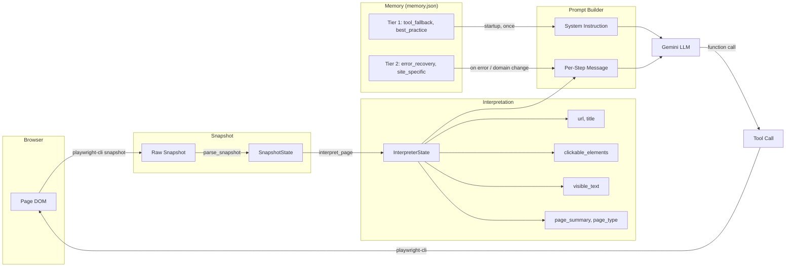
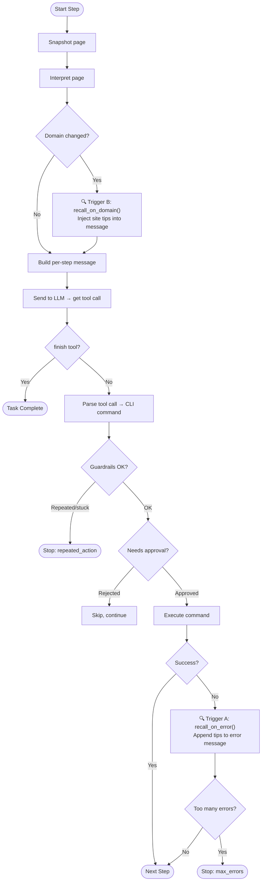
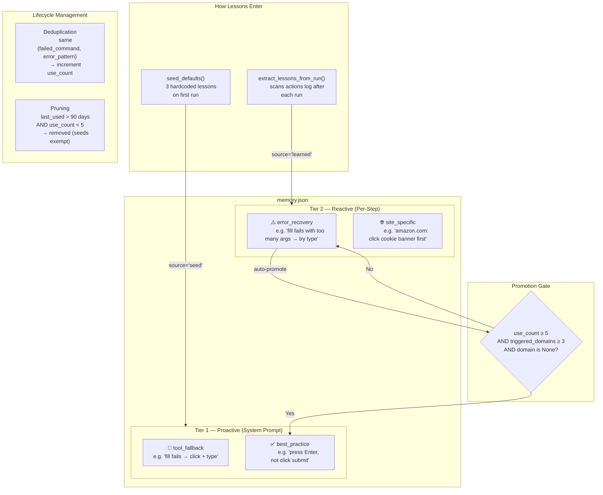

# Two-Tiered Memory System

The browser agent learns from its mistakes across runs. Instead of hardcoding every recovery strategy into the prompt, the memory system captures failure→recovery patterns and surfaces them when relevant.

## Architecture Overview

### Full Agent Context Flow

This diagram shows how data flows from the browser, through interpretation and memory, into the LLM prompt:



### Decision Loop with Memory Triggers

This diagram shows the step-by-step decision loop and where the two memory triggers fire:



### Hybrid Memory Structure

This diagram shows how the two tiers relate, how lessons flow between them, and the promotion path:



### How the Hybrid Works

The memory is **hybrid** because it combines two different retrieval strategies:

1. **Category-based eligibility** (not frequency-based) determines which tier a lesson belongs to. Only `tool_fallback` and `best_practice` categories qualify for Tier 1. This is a design choice — these categories represent universal truths that the LLM should always know.

2. **Structured field matching** powers Tier 2 retrieval. Instead of semantic search, lessons are matched by comparing `failed_command` and `error_pattern` fields against the actual error, or `domain` against the current URL. This is fast, deterministic, and debuggable.

3. **Automatic promotion** bridges the two tiers. A lesson starts as `error_recovery` (Tier 2) but gets promoted to `best_practice` (Tier 1) once it proves itself universal — triggered 5+ times across 3+ different domains. This means the system self-optimizes: patterns that keep recurring graduate into always-on advice.

### Tier 1 — Proactive (system prompt)

Universal lessons injected into the system instruction at the start of every run. The LLM always sees these.

- **Eligibility**: Only lessons with category `tool_fallback` or `best_practice` qualify.
- **Cap**: Maximum 10 lessons to avoid prompt bloat.
- **Sorting**: By use count (most used first), seeds before learned.

### Tier 2 — Reactive (per-step message)

Searched on demand and injected into the user message for a specific step. Two triggers:

| Trigger | When | What's searched | Where injected |
|---------|------|-----------------|----------------|
| **A — Error** | A command fails (`exec_status != "ok"`) | `recall_on_error(command, error)` matches `failed_command` and `error_pattern` | Appended to `last_step_error` as "Tips from previous experience" |
| **B — Domain change** | The page URL domain changes | `recall_on_domain(domain)` matches `domain` field (including subdomains) | Injected as `domain_context` in `build_page_message()` |

## Lesson Data Model

Each lesson is a structured record:

| Field | Type | Description |
|-------|------|-------------|
| `lesson` | str | Human-readable advice |
| `category` | str | `tool_fallback` / `best_practice` / `error_recovery` / `site_specific` |
| `failed_command` | str? | CLI command that failed (e.g. `"fill"`) |
| `error_pattern` | str? | Key phrase from the error (e.g. `"too many arguments"`) |
| `domain` | str? | Site this applies to (e.g. `"amazon.com"`) |
| `use_count` | int | How many times this lesson was triggered |
| `created_at` | str | Date created (YYYY-MM-DD) |
| `last_used` | str | Date last triggered |
| `source` | str | `"seed"` (hardcoded) or `"learned"` (from runs) |
| `triggered_domains` | list[str] | Domains where this lesson was useful |

## Lifecycle

### 1. Startup

```python
memory = MemoryStore()
memory.load()  # reads ~/.browser_agent/memory.json, seeds defaults on first run
```

Tier 1 lessons are passed to `build_system_instruction()`:

```python
system_instruction = build_system_instruction(
    task, skill_text, tier1_lessons=memory.get_tier1()
)
```

### 2. During a run

In the decision loop:

- **After interpretation**: If the domain changed, `recall_on_domain()` fetches site-specific tips and passes them as `domain_context` to `build_page_message()`.
- **After a command error**: `recall_on_error()` finds matching lessons and appends them to the error message the LLM sees.

### 3. After a run

`extract_lessons_from_run()` scans the actions log (JSONL) for failure→recovery patterns:

```
Step N: command A → error (stderr contains "some error")
Step N+1: command B → ok
```

If A ≠ B and the error is substantive, a new `error_recovery` lesson is recorded (or an existing one's `use_count` is incremented).

### 4. Promotion

An `error_recovery` lesson is automatically promoted to `best_practice` (and thus enters Tier 1) when:

- `use_count >= 5` — it's been triggered enough times
- `triggered_domains >= 3` — it's proven useful across multiple sites
- `domain is None` — it's not site-specific

### 5. Pruning

On every `load()`, stale lessons are removed:

- **Seeds**: Never pruned.
- **Learned lessons**: Pruned if `last_used` is older than 90 days AND `use_count < 5`.

### 6. Deduplication

When recording a lesson, if an existing lesson has the same `(failed_command, error_pattern)` pair, the existing one's `use_count` is incremented instead of creating a duplicate.

## Seed Lessons

Three lessons are seeded on first run:

1. **Fill fallback** (`tool_fallback`): If `fill` fails, use `click` + `type` instead.
2. **Press Enter to submit** (`best_practice`): After entering search text, press Enter instead of clicking the submit button (autocomplete dropdowns often block it).
3. **Escape overlays** (`best_practice`): Press Escape to dismiss overlays before interacting with elements behind them.

## Walkthrough Examples

### Example 1: Fill fails on Google — Tier 2 error recall + post-run learning

The user asks the agent to search "padel rackets" on Google.

**Run 1 (no memory yet — seeds only):**

```
Step 3: fill(ref="e37", value="padel rackets")
        → ERROR: "too many arguments: expected 2, received 3"

        Memory Trigger A fires:
          recall_on_error("fill", "too many arguments: expected 2, received 3")
          → Matches seed lesson: "If fill fails, click(ref) to focus the input,
            then type(text) to enter text."

        The LLM sees:
          "IMPORTANT - Last action failed:
           too many arguments: expected 2, received 3

           Tips from previous experience:
           - If fill fails, click(ref) to focus the input, then type(text) to enter text."

Step 4: click(ref="e37")  → OK
Step 5: type(text="padel rackets")  → OK
Step 6: press(key="Enter")  → OK  ✅ Search submitted
```

**Post-run:** `extract_lessons_from_run()` scans the actions log, sees fill→error then click→ok, records a new `error_recovery` lesson. But it's a duplicate of the seed, so `use_count` is incremented instead.

### Example 2: Domain-specific lesson — Amazon cookie banner

After several runs on Amazon, the agent has learned a site-specific lesson:

```json
{
  "lesson": "Click the cookie acceptance banner before interacting with product elements.",
  "category": "site_specific",
  "domain": "amazon.com",
  "use_count": 4
}
```

**Next run on Amazon:**

```
Step 1: goto("https://www.amazon.com")  → OK

Step 2: snapshot → interpret
        Domain = "www.amazon.com"

        Memory Trigger B fires:
          recall_on_domain("www.amazon.com")
          → Matches: "amazon.com" (subdomain match)

        The LLM sees in its per-step message:
          "Tips for this site:
           - Click the cookie acceptance banner before interacting with product elements."

Step 3: The LLM clicks the cookie banner first, then proceeds with the task.  ✅
```

### Example 3: Promotion from Tier 2 to Tier 1

A learned lesson starts in Tier 2 and gets promoted:

```
After run on google.com:
  Lesson recorded: "When click fails with 'intercepts pointer events', try press(key='Escape') first."
  category: error_recovery  |  use_count: 1  |  triggered_domains: ["google.com"]

After run on bing.com:
  Same pattern seen → use_count: 2  |  triggered_domains: ["google.com", "bing.com"]

After run on amazon.com:
  use_count: 3  |  triggered_domains: ["google.com", "bing.com", "amazon.com"]

... several more runs ...

After run on reddit.com:
  use_count: 5  |  triggered_domains: ["google.com", "bing.com", "amazon.com", "yahoo.com", "reddit.com"]

  ✅ PROMOTED: category changes from "error_recovery" → "best_practice"
  This lesson now appears in the system prompt for ALL future runs (Tier 1).
```

### Example 4: What the LLM actually sees

**System prompt** (set once at run start, includes Tier 1):

```
You are a browser automation agent...

## Lessons from experience

These are lessons learned from previous runs. Follow them.
- If fill fails, click(ref) to focus the input, then type(text) to enter text.
- After entering text in a search box, press Enter to submit. Avoid clicking submit buttons...
- If an overlay or popup is blocking an element, press Escape to dismiss it...

## Goal

Search for "padel rackets" on Google
```

**Per-step message** (when an error occurs, includes Tier 2):

```
Current page:
URL: https://www.google.com
Title: Google
Type: search_engine

Page summary:
Google homepage with search box and navigation links.

Clickable elements:
e37: combobox - Search
e60: button - Google Search
...

IMPORTANT - Last action failed:
too many arguments: expected 2, received 3

Tips from previous experience:
- If fill fails, click(ref) to focus the input, then type(text) to enter text.

Call the appropriate tool for the next action.
```

## Files Modified

| File | Change |
|------|--------|
| `browser_agent/memory.py` | New — core memory module |
| `browser_agent/prompt_builder.py` | Added `tier1_lessons` param to `build_system_instruction()`, `domain_context` param to `build_page_message()` |
| `browser_agent/decision_loop.py` | Added `memory` param, Trigger A (error recall), Trigger B (domain recall), post-run learning |
| `browser_agent/main.py` | Creates `MemoryStore`, wires it into planner and decision loop |
| `tests/test_memory.py` | New — 19 tests covering all memory functionality |

## Storage

Memory is stored at `~/.browser_agent/memory.json` (same directory as `config.yaml`). Example:

```json
{
  "version": 1,
  "lessons": [
    {
      "lesson": "If fill fails, click(ref) to focus the input, then type(text) to enter text.",
      "category": "tool_fallback",
      "failed_command": "fill",
      "error_pattern": "too many arguments",
      "domain": null,
      "use_count": 3,
      "created_at": "2026-03-12",
      "last_used": "2026-03-12",
      "source": "seed",
      "triggered_domains": ["google.com", "amazon.com"]
    }
  ]
}
```

## Observability — Memory Events Log

Each run produces a `memory_events.jsonl` file alongside the other run logs. It records every interaction the memory system has during a run, making it easy to verify what was accessed, what matched, and what changed.

### Event Types

| Event | When | Key Fields |
|-------|------|------------|
| `tier1_loaded` | Run startup (`get_tier1()`) | `count`, `lessons` (list of lesson texts) |
| `error_recall` | Trigger A — command fails | `command`, `error_snippet`, `matched` (count), `lessons` |
| `domain_recall` | Trigger B — domain changes | `domain`, `matched` (count), `lessons` |
| `lesson_recorded` | Post-run learning finds a new pattern | `lesson`, `category`, `failed_command`, `error_pattern` |
| `lesson_deduplicated` | Post-run learning matches an existing lesson | `lesson`, `new_use_count` |
| `lesson_promoted` | `error_recovery` → `best_practice` | `lesson`, `use_count`, `triggered_domains` |
| `lessons_pruned` | On `load()`, stale lessons removed | `pruned_count`, `remaining_count` |

### How It Works

`MemoryStore` accepts an optional `on_event` callback (`Callable[[dict], None]`). When provided, every retrieval, recording, promotion, and pruning operation emits a structured dict to the callback. In production, `main.py` wires this to `append_jsonl(paths.memory_events_log, evt)`.

The memory module has no dependency on the logger — the callback is injected from the outside.

### Example Output

After a run, `runs/run_20260312T143000Z/memory_events.jsonl` might contain:

```json
{"event": "tier1_loaded", "count": 3, "lessons": ["If fill fails, click(ref) to focus the input, then type(text) to enter text.", "After entering text in a search box, press Enter to submit...", "If an overlay or popup is blocking an element, press Escape..."]}
{"event": "domain_recall", "domain": "www.google.com", "matched": 0, "lessons": []}
{"event": "error_recall", "command": "fill", "error_snippet": "too many arguments: expected 2, received 3", "matched": 1, "lessons": ["If fill fails, click(ref) to focus the input, then type(text) to enter text."]}
{"event": "lesson_deduplicated", "lesson": "If fill fails, click(ref) to focus the input, then type(text) to enter text.", "new_use_count": 4}
```

### Querying Events

```bash
# All memory activity for the latest run
cat runs/run_*/memory_events.jsonl | python -m json.tool

# Only error recalls (did Trigger A fire? what matched?)
grep "error_recall" runs/run_*/memory_events.jsonl

# Only domain recalls (did Trigger B fire? what matched?)
grep "domain_recall" runs/run_*/memory_events.jsonl

# Check for promotions across all runs
grep "lesson_promoted" runs/run_*/memory_events.jsonl

# Count how often each event type fires
cat runs/run_*/memory_events.jsonl | python -c "
import sys, json, collections
c = collections.Counter()
for line in sys.stdin:
    c[json.loads(line)['event']] += 1
for k, v in c.most_common(): print(f'{k}: {v}')
"
```
