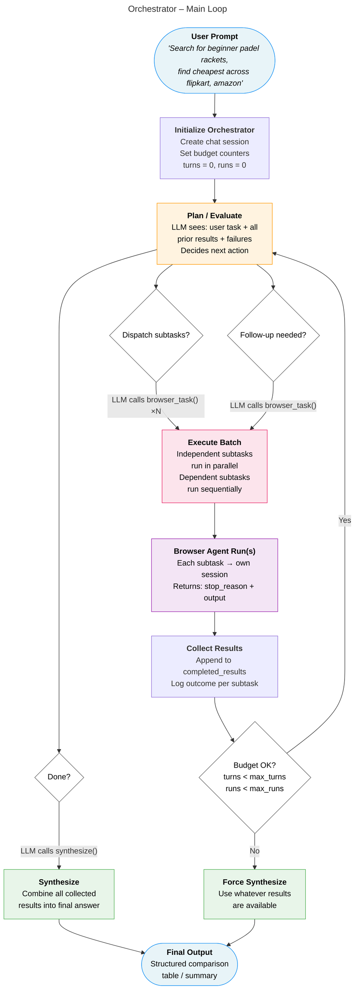
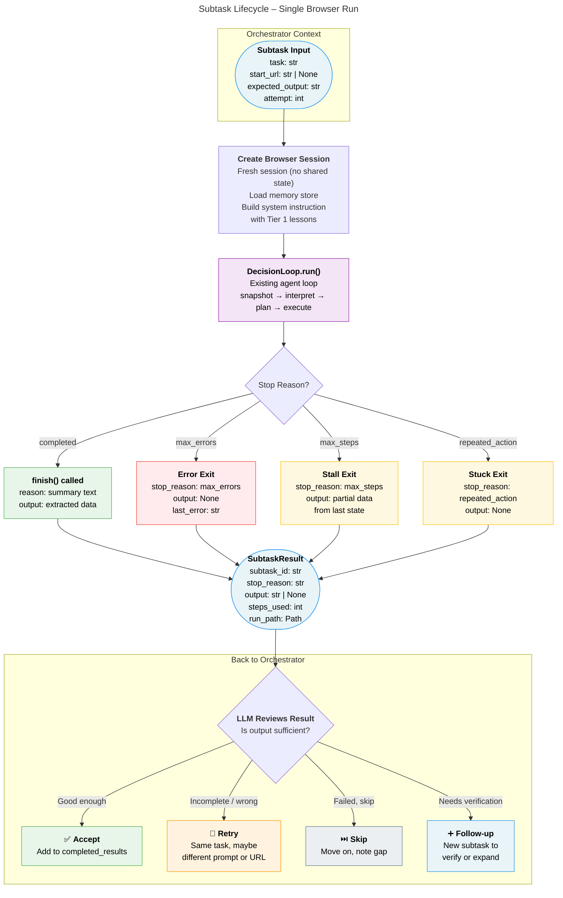
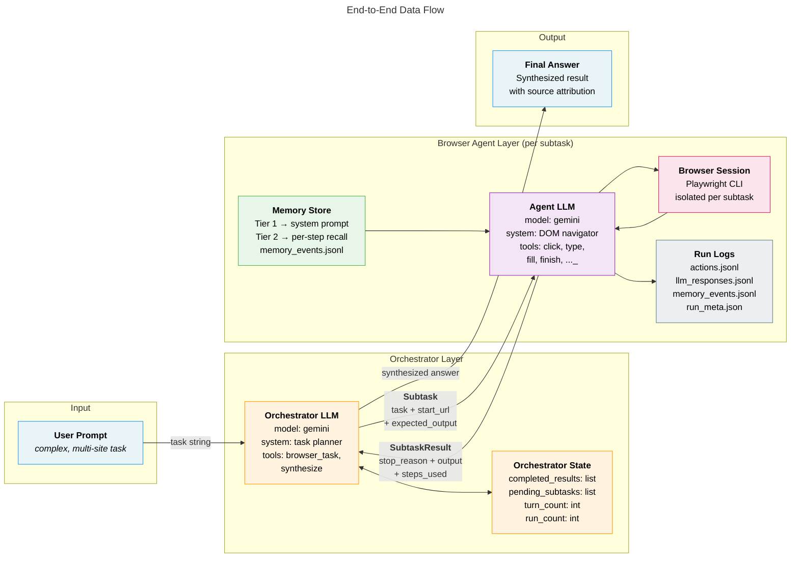

# Orchestrator Architecture — Next Step

This document describes the planned two-layer architecture that enables the browser agent to handle complex, multi-site tasks by adding a task orchestrator on top of the existing browser agent.

## Problem

The current agent handles single-site, single-goal tasks well:

```
"search for beginner padel rackets on amazon"
```

But complex tasks that span multiple sites or require follow-up research can't be expressed as a single browser run:

```
"Search for beginner padel rackets, find the cheapest ones across flipkart, amazon, etc."
```

This requires decomposition, parallel execution, result review, and potentially follow-up queries — none of which the current single-loop agent supports.

## Solution: Two-Layer Architecture

An **orchestrator** layer sits above the existing browser agent. It decomposes complex tasks, dispatches subtasks to independent browser agent runs, reviews results, and iterates until it has enough information to synthesize a final answer.

The browser agent remains unchanged except for one addition: the `finish` tool gains an `output` field so the agent can return extracted data, not just a completion reason.

## Architecture Overview

### Orchestrator Main Loop

The orchestrator is an iterative LLM loop (not a static planner). After each batch of subtask results, the LLM decides whether to continue, retry, follow up, or synthesize.



### Subtask Lifecycle

Each browser run is independent — fresh session, no shared state. The orchestrator evaluates the result and decides the next action.



### End-to-End Data Flow

Shows the clean separation between the orchestrator (task planning + synthesis) and the browser agent (DOM interaction + data extraction).



## Design Decisions

### 1. Iterative loop, not static planner

A static "decompose → execute all → done" approach can't handle:
- Subtask failures that need retries with different prompts
- Results that raise follow-up questions ("is racket X actually beginner-level?")
- Sites that have no results, requiring pivots to alternative sites

The orchestrator loop lets the LLM make these strategic decisions naturally, just as a human researcher would.

### 2. LLM-driven retry strategy

The orchestrator LLM — not hard-coded logic — decides how to handle failures:

| Situation | LLM Decision |
|-----------|--------------|
| Transient failure (timeout) | Exact retry |
| Agent misunderstood task | Retry with rephrased prompt |
| Wrong site section | Retry with different start URL |
| Site has no results | Pivot to alternative site |
| One source is enough | Skip and compensate |
| Task impossible | Abort with explanation |

### 3. Browser agent returns structured output

The `finish` tool needs an `output` field so the agent can return extracted data:

```python
finish(
    reason="Found 12 beginner padel rackets on Amazon",
    output="1. ProKennex Starter - ₹4,500\n2. Head Flash - ₹5,200\n..."
)
```

This is the only change to the existing browser agent.

### 4. Session isolation

Each subtask gets its own browser session. No shared cookies, storage, or state between runs. The orchestrator holds the shared context — the browser agent doesn't know it's being orchestrated.

### 5. Parallel execution for independent subtasks

Independent subtasks (amazon + flipkart) run in parallel — separate browser sessions, no shared state. Dependent subtasks ("confirm X is beginner" depends on amazon results) run sequentially, after their dependencies complete.

### 6. Budget guardrails

The orchestrator has hard limits to prevent infinite loops:

| Guard | Default | Purpose |
|-------|---------|---------|
| `max_turns` | 10 | Max orchestrator planning iterations |
| `max_runs` | 6 | Max total browser agent runs |
| `max_retries_per_subtask` | 2 | Max attempts for the same subtask |

If limits are hit, the orchestrator force-synthesizes from whatever results are available.

## Data Model

### Subtask (orchestrator → browser agent)

| Field | Type | Description |
|-------|------|-------------|
| `id` | str | Unique subtask identifier |
| `task` | str | Natural language task for the browser agent |
| `start_url` | str? | Starting URL |
| `expected_output` | str | What data to extract (guides the agent) |
| `depends_on` | list[str] | Subtask IDs this depends on |
| `attempt` | int | Which attempt this is (1-based) |

### SubtaskResult (browser agent → orchestrator)

| Field | Type | Description |
|-------|------|-------------|
| `subtask_id` | str | Which subtask this is for |
| `stop_reason` | str | How the run ended (completed/max_errors/max_steps/...) |
| `output` | str? | Extracted data from `finish()`, if any |
| `steps_used` | int | How many steps the agent took |
| `run_path` | Path | Path to the run logs for debugging |

## Orchestrator LLM Conversation Example

```
System: You are a task orchestrator. Break complex tasks into focused browser
        subtasks. Each subtask should target a single site with a clear expected
        output. You have two tools:
        - browser_task(task, start_url, expected_output): run a browser agent
        - synthesize(answer): combine results into a final answer
        After results come back, you can plan follow-ups or synthesize.

User: "Search for beginner padel rackets, find cheapest across flipkart, amazon"

LLM → browser_task(
    task="Search for beginner padel rackets, list 10-15 cheapest options with prices",
    start_url="https://www.amazon.in",
    expected_output="List of rackets with name, price, and URL"
)
LLM → browser_task(
    task="Search for beginner padel rackets, list 10-15 cheapest options with prices",
    start_url="https://www.flipkart.com",
    expected_output="List of rackets with name, price, and URL"
)

[Results return — amazon: 12 rackets, flipkart: 3 rackets (sparse)]

LLM: Flipkart results are sparse. Let me try Decathlon as well.
     Also, "ProKennex Starter" appears on amazon but I want to verify it's
     actually a beginner racket.

LLM → browser_task(
    task="Search for beginner padel rackets, list cheapest options with prices",
    start_url="https://www.decathlon.in",
    expected_output="List of rackets with name, price, and URL"
)
LLM → browser_task(
    task="Check if ProKennex Starter padel racket is suitable for beginners",
    start_url="https://www.google.com",
    expected_output="Confirmation with source"
)

[Results return — decathlon: 8 rackets, verification: confirmed beginner]

LLM → synthesize(
    "Here are the cheapest beginner padel rackets across sites:
     | Racket | Amazon | Flipkart | Decathlon |
     | ...    | ...    | ...      | ...       |"
)
```

## Changes Required to Existing Code

This section describes every file that needs to be touched — what changes, why, and how. If you're implementing this, work through them in order.

### Files to Modify

#### 1. `browser_agent/tool_definitions.py` — Add `output` to the `finish` tool

**What it does today**: The `finish` tool has one field — `reason` — which is a short summary string like "Task completed, found 3 results". This is meant for logging, not for returning data.

**What needs to change**: Add a second field called `output` (type: string, optional). This is where the browser agent writes the actual extracted data — the list of products, prices, verification results, whatever the orchestrator asked for.

**Why**: Right now the agent says "I'm done" but doesn't hand back the data it found. The orchestrator needs that data to review results, plan follow-ups, and synthesize the final answer. Without `output`, the orchestrator would have to parse action logs to figure out what the agent found — that's fragile and ugly.

**Example of what changes**:
```
Before: finish(reason="Found padel rackets on Amazon")
After:  finish(reason="Found padel rackets on Amazon",
               output="1. ProKennex Starter - ₹4,500\n2. Head Flash - ₹5,200\n...")
```

**What stays the same**: The `reason` field still works exactly as before. Single-task runs that don't use the orchestrator don't need to pass `output` — it's optional. Nothing breaks.

---

#### 2. `browser_agent/decision_loop.py` — Return structured result from `run()`

**What it does today**: `DecisionLoop.run()` returns a single string — the stop reason (e.g., `"completed"`, `"max_errors"`, `"repeated_action"`). When the agent calls `finish`, the output is logged to `actions.jsonl` but then thrown away. The caller (main.py) currently ignores the return value entirely.

**What needs to change**: `run()` should return a structured result — not just a string. Create a small dataclass (call it `RunResult`) with:
- `stop_reason: str` — same as today
- `finish_output: str | None` — the `output` value from the `finish` call, if the agent completed successfully
- `steps_used: int` — how many steps the agent took

Also add an instance variable (like `self.finish_output`) that captures the `output` argument when the agent calls the `finish` tool. Right now the code logs `reason` from the finish args but doesn't store it anywhere accessible.

**Why**: The orchestrator calls `DecisionLoop.run()` and needs to read back what the agent found. Without this, there's no way to get the data out of a browser run programmatically.

**What stays the same**: The decision loop itself — snapshot, interpret, plan, execute — is completely untouched. The guardrails, approval system, memory triggers, error handling — none of that changes. We're only changing what `run()` returns, not what it does.

---

#### 3. `browser_agent/prompt_builder.py` — Accept an `expected_output` hint

**What it does today**: `build_system_instruction()` takes a `task` string and `skill_text` and builds the system prompt. The task is something like "search for beginner padel rackets on amazon".

**What needs to change**: Add an optional `expected_output` parameter. When provided, it gets included in the system prompt to tell the agent what kind of data to extract and return in `finish(output=...)`. Something like:

```
## Expected Output
When you complete the task, call finish() with the following data in the output field:
List of rackets with name, price, and URL
```

**Why**: When the orchestrator dispatches a subtask, it knows what data it needs back (e.g., "list of rackets with name, price, URL"). Without this hint, the agent might complete the task but return a vague summary instead of the structured data the orchestrator needs. The `expected_output` guides the agent on *what to extract*, not just *what to do*.

**What stays the same**: When `expected_output` is `None` (regular single-task runs), the system prompt is identical to today. The parameter is purely additive.

---

#### 4. `browser_agent/main.py` — Add orchestrator entry path

**What it does today**: Parses CLI args, loads config, creates a single `ChatPlanner` + `DecisionLoop`, calls `loop.run()`, exits.

**What needs to change**: Add an `--orchestrate` flag (or possibly auto-detect). When active, instead of creating a single `DecisionLoop`, `main()` creates an `Orchestrator` and delegates to it. The orchestrator internally creates its own `DecisionLoop` instances for each subtask.

The existing setup code (config loading, skill checking, memory initialization) is reused — the orchestrator needs all the same pieces. The difference is that instead of one browser run, there may be several, and the orchestrator manages the lifecycle.

**Why**: This is the user-facing entry point. A user running a complex task should be able to say:
```bash
browser-agent "find cheapest padel rackets across amazon and flipkart" --orchestrate
```
and get the orchestrator behavior, vs:
```bash
browser-agent "search for padel rackets on amazon" --safe
```
for a simple single-site task.

**What stays the same**: The entire single-task flow. If `--orchestrate` is not set, `main()` works exactly as it does today. No existing behavior changes.

---

#### 5. `browser_agent/logger.py` — Add orchestrator-level log structure

**What it does today**: `RunPaths` defines the directory structure for a single run — snapshots, screenshots, various JSONL logs, run_meta.json.

**What needs to change**: Add a concept of an orchestrator run directory that contains:
- An orchestrator-level log (`orchestrator_log.jsonl`) — records each planning turn, subtask dispatches, result reviews, and decisions
- Subdirectories for each subtask, each one being a standard `RunPaths` structure
- A final result file (`result.json`) with the synthesized answer

```
runs/orchestrator_20260312T143000Z/
  orchestrator_log.jsonl       # what the orchestrator LLM planned and decided
  subtask_001/                 # standard run directory (snapshots, actions.jsonl, etc.)
  subtask_002/                 # standard run directory
  result.json                  # final synthesized output
```

**Why**: Without this, you can't debug orchestrator behavior. You need to see: what did the orchestrator plan? Why did it retry? What results did it review? This log is the orchestrator's equivalent of `actions.jsonl` for the browser agent.

**What stays the same**: The existing `RunPaths` class and single-run log structure. Subtask directories reuse the exact same structure. We're adding a parent layer on top, not changing the child layer.

---

### Files to Add (New)

#### 6. `browser_agent/orchestrator.py` — The orchestrator loop (core new module)

**What it does**: This is the main new code. It contains:

- **`Orchestrator` class** — holds the orchestrator's LLM chat session, budget counters, and completed results. Implements the iterative loop: plan → dispatch → collect → review → decide.
- **Subtask dispatch** — for each subtask the LLM plans, it creates a fresh `DecisionLoop` (with its own `ChatPlanner`, `PlaywrightExecutor`, `MemoryStore`) and calls `run()`. Independent subtasks can run in parallel; dependent ones run sequentially.
- **Result collection** — reads the `RunResult` from each browser run and feeds it back to the orchestrator LLM as a tool result.
- **Budget enforcement** — tracks turn count, total runs, and retries per subtask. If limits are exceeded, forces synthesis from available results.

**Key constraint**: This module imports from `decision_loop`, `planner`, `memory`, `logger`, etc. — but *none of those modules import from it*. The dependency is strictly one-way. The browser agent has zero awareness of the orchestrator.

#### 7. Orchestrator tool definitions — Two tools

**What it does**: Defines the orchestrator's tool declarations (same pattern as `tool_definitions.py` but for the orchestrator LLM):

- `browser_task(task, start_url, expected_output)` — tells the orchestrator to dispatch a browser agent run
- `synthesize(answer)` — signals the orchestrator is done and provides the final answer

These are completely separate from the browser agent's tools (click, type, fill, etc.). The orchestrator never touches the DOM.

#### 8. Orchestrator system prompt

**What it does**: A system prompt tuned for task decomposition (not DOM navigation). Tells the LLM:
- How to break complex tasks into single-site, single-goal subtasks
- What makes a good `expected_output` description
- How to evaluate results — is the output sufficient? Should it retry, skip, or follow up?
- When to spawn follow-up tasks
- Budget awareness — "you have N browser runs remaining, use them wisely"

This is a text string, not a separate file — same pattern as the existing system prompt in `prompt_builder.py`.

---

### Files That Do NOT Change

These files are part of the browser agent's inner loop. The orchestrator sits *above* this layer and never touches it:

| File | Why it's untouched |
|------|--------------------|
| `snapshot_parser.py` | DOM parsing is browser-layer only — the orchestrator never sees raw DOM |
| `interpreter.py` / `interpreter_state.py` | Page interpretation is browser-layer only |
| `action_parser.py` | CLI command parsing is internal to browser runs |
| `guardrails.py` | Repeated action / stuck detection is per-run, unchanged |
| `approval_system.py` | Approval flow is per-run, unchanged |
| `playwright_executor.py` | Browser execution layer is untouched |
| `memory.py` | Memory is per-browser-run — orchestrator doesn't have its own memory |
| `skill_loader.py` / `skill_checker.py` | Skill management is unchanged |
| `config_manager.py` | May get a few new fields for budget limits, but the structure stays the same |

### Summary

| Action | Files | Size of change |
|--------|-------|----------------|
| **Modify** | `tool_definitions.py`, `decision_loop.py`, `prompt_builder.py`, `main.py`, `logger.py` | Small — each is a targeted, additive change |
| **Add** | `orchestrator.py`, orchestrator tool defs, orchestrator system prompt | Medium — the orchestrator loop is the main new work |
| **Delete** | Nothing | Nothing gets removed |

The golden rule: **the browser agent doesn't know it's being orchestrated.** All orchestrator complexity lives in new code. The existing agent gets two small changes (finish output field + structured return from run), and everything else stays exactly as it is.
